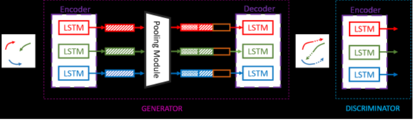

# Social GAN: Socially Acceptable trajectories with Generative Adversarial Networks
## Main features
- sequence prediction 
- generative adversarial networks
- pooling mechanism (novel)

## Intro
*human behaviour in crowd scenes*
- Interpersonal : read behaviour of others while navigating
- Socially acceptable : such as yielding right-of-your way
- Multimodal: multiple valid trajectories   

## issues with previous methods (GAP)
1. model local neighborhood only while predicting
   - Soln: model interaction as well
2. learn average behaviour (Euclidian distance loss minimization ground truth and forcasted output)
   - soln: learn good behaviour, i.e multiple socially acceptable trajectories

## Method
1. GAN:  Generative adversarial networks 
   - Genrator: RNN based Encoder and Decoder
   - Pooling Module: connects Encoder and Decoder  in Generator
   - Discriminator: 
      1. novelty: variety loss  (spread distribution to cover  space of possible paths)
      2. pooling mechanism :encode subtle cues from all people involved in a scene
   
 ### **Model**

1. Generator: 
      - Input: X_i_ = (xt_i_ ; yt_i_ ) -> input trajectory from _t = 1; .  .  .; tobs_ 
      - Output: predicted trajectory Ŷ_i_
2. Discriminator: 
    - Input:
      -  X_i_ = (xt_i_ ; yt_i_ ) -> input trajectory from _t = 1, .  .  . , t_obs_
      -  Ŷ_i_ = (xt_i_ ; yt_i_ ) -> predicted trajectory from _t = tobs_ + 1, . . ., t_pred_

    - Output:  classification as real or fake

